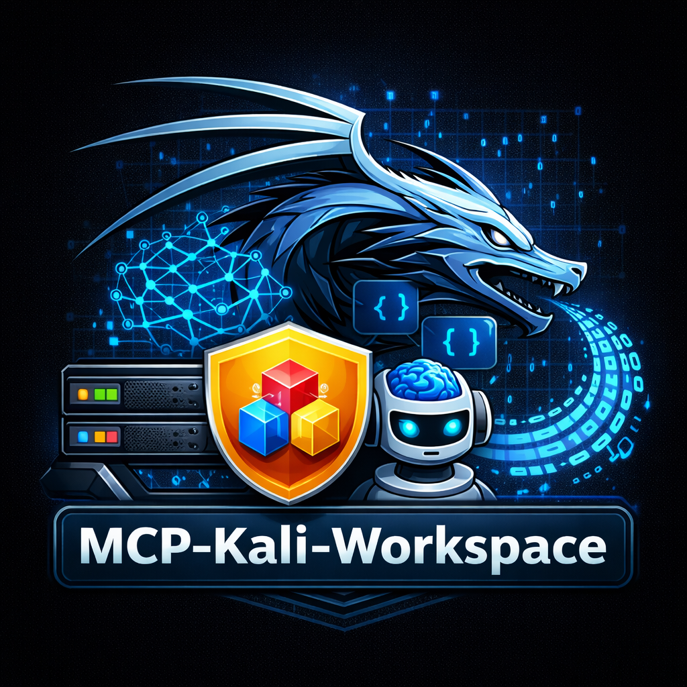

  # MCP Kali Workspace

  
  
  [](https://marketplace.visualstudio.com/)
  [](https://opensource.org/licenses/MIT)
  
  **AI-Powered Penetration Testing with GitHub Copilot and Kali Linux**
  
Integrate Kali Linux security tools directly into VS Code through Model Context Protocol (MCP), enabling GitHub Copilot to execute security commands, automate reconnaissance, and assist with CTF challenges in real-time.

## Features

- 🚀 **One-Command Setup** - Configure workspace for Kali MCP integration with a single command
- 🤖 **AI-Assisted Security Testing** - GitHub Copilot can execute Kali tools (nmap, gobuster, nikto, etc.)
- 🎯 **Workspace-Specific** - Each project gets its own isolated MCP configuration
- 🔧 **Automatic Configuration** - Creates Python venv, installs dependencies, configures MCP server
- 🔒 **Secure** - Connects to remote Kali VM via configurable endpoint
- 💾 **SMB/Network Share Compatible** - Venv stored in local cache to avoid symlink issues
- 🪟 **Cross-Platform** - Works on Windows, Linux, and macOS
- 🧹 **Easy Cleanup** - Remove workspace configuration with one command

## Requirements

### On Your Kali VM
- Kali Linux with `kali-server-mcp` installed
- `kali-server-mcp` running on port 5000:
  ```bash
  kali-server-mcp --ip 0.0.0.0 --port 5000
  ```

### On Your Development Machine
- VS Code 1.102 or later
- Python 3.8+
- GitHub Copilot subscription
- Network access to Kali VM

## Quick Start

### 1. Install Extension

Install from VS Code Marketplace or via `.vsix`:
```bash
code --install-extension mcp-kali-workspace-0.1.0.vsix
```

### 2. Open a Workspace

Open any folder/workspace where you want Kali integration.

### 3. Run Setup Command

- Press `Ctrl+Shift+P` (or `Cmd+Shift+P` on Mac)
- Type: `MCP Kali: Setup Workspace`
- Enter your Kali VM IP address (e.g., `192.168.110.23`)

### 4. Reload Window

When prompted, reload VS Code to activate the MCP server.

### 5. Start Using!

Open GitHub Copilot Chat (`Ctrl+Alt+I`) and ask:
- "Run an nmap scan on 192.168.1.1"
- "Use gobuster to enumerate directories on http://target.com"
- "Help me solve this CTF web challenge"

## What Gets Created

The extension creates the following structure:

### In Your Workspace
```
your-workspace/
├── .mcp-kali/
│   ├── mcp_server.py         # MCP protocol bridge
│   ├── requirements.txt       # Python dependencies
│   └── mcp-wrapper.sh         # Execution wrapper (or .cmd on Windows)
└── .vscode/
    └── mcp.json               # MCP server configuration
```

### In Your Home Directory
```
~/.cache/mcp-kali-workspace/   # (Linux/macOS)
└── venv/                       # Shared Python virtual environment
    ├── bin/
    ├── include/
    ├── lib/
    └── pyvenv.cfg

%USERPROFILE%\.cache\mcp-kali-workspace\  # (Windows)
└── venv\                       # Shared Python virtual environment
    ├── Scripts\
    ├── Lib\
    └── pyvenv.cfg
```

**Note:** The Python virtual environment is stored in your home directory's cache to avoid symlink issues with SMB shares and network drives. This venv is shared across all workspaces using the extension.

## How It Works

1. **Extension Installation** - Creates shared Python venv in `~/.cache/mcp-kali-workspace/` and installs dependencies
2. **Workspace Setup** - Downloads latest `mcp_server.py` from GitLab and creates workspace configuration
3. **Local MCP Server** - Runs `mcp_server.py` from workspace's `.mcp-kali/` directory using shared venv
4. **Remote Kali API** - Connects to `kali-server-mcp` on your Kali VM (port 5000)
5. **GitHub Copilot** - Uses MCP protocol to invoke Kali security tools
6. **Tool Execution** - Commands execute on Kali VM, results return to VS Code

## Usage Examples

### Network Reconnaissance
```
@workspace Run nmap -sV -T4 192.168.1.0/24
```

### Web Application Testing
```
Help me enumerate directories on http://target.com using gobuster
```

### CTF Assistance
```
I found a login form at http://ctf.com/login - help me test for SQL injection
```

### Custom Security Tasks
```
Run nikto against https://example.com and analyze the results
```

## Troubleshooting

### MCP Server Not Connecting

**Check Kali Server:**
```bash
# On Kali VM
curl http://localhost:5000/health
```

Should return: `{"status":"healthy"}`

**Check VS Code Output:**
- View → Output
- Select "MCP" from dropdown
- Look for connection errors

### Python Environment Issues
Remove workspace configuration and re-run setup:
- Press `Ctrl+Shift+P`
- Run: `MCP Kali: Remove Workspace Configuration`
- Run: `MCP Kali: Setup Workspace`

Or manually delete `.mcp-kali/`:
```bash
rm -rf .mcp-kali
```

### Clean Cache Directory

The cache directory is automatically cleaned when you uninstall the extension. If you want to manually recreate the shared venv:
```bash
# Linux/macOS
rm -rf ~/.cache/mcp-kali-workspace

# Windows
rmdir /s %USERPROFILE%\.cache\mcp-kali-workspace
```

Then reload VS Code (the extension will recreate the venv on activation).

### Network Connectivity

Verify you can reach Kali from your dev machine:
```bash
curl http://<kali-ip>:5000/health
```

## Configuration

### Custom Kali Port

Edit `.vscode/mcp.json`:
```json
{
  "servers": {
    "kaliMcp": {
      "type": "stdio",
      "command": "/path/to/.mcp-kali/mcp-wrapper.sh",
      "args": [
        "--server",
        "http://<kali-ip>:<custom-port>"
      ]
    }
  }
}
```

### Multiple Kali Servers

You can configure multiple Kali instances by editing `mcp.json` manually.

## Privacy & Security

- **Local Execution** - MCP server runs locally in your workspace
- **Network Only** - Only connects to Kali VM you specify
- **No Telemetry** - Extension doesn't collect or send usage data
- **Workspace Isolation** - Each workspace has independent configuration

## Contributing

Contributions welcome! Please check the repository for contribution guidelines.

## License

MIT License - See LICENSE file for details

## Resources

- [Model Context Protocol](https://modelcontextprotocol.io/)
- [Kali MCP Server](https://www.kali.org/tools/mcp-kali-server/)
- [GitHub Copilot](https://github.com/features/copilot)

## Disclaimer

This tool is for **authorized security testing only**. Users are responsible for ensuring they have permission to test target systems. Unauthorized access is illegal.

---

**Made with ❤️ for security professionals, CTF players, and bug bounty hunters**
